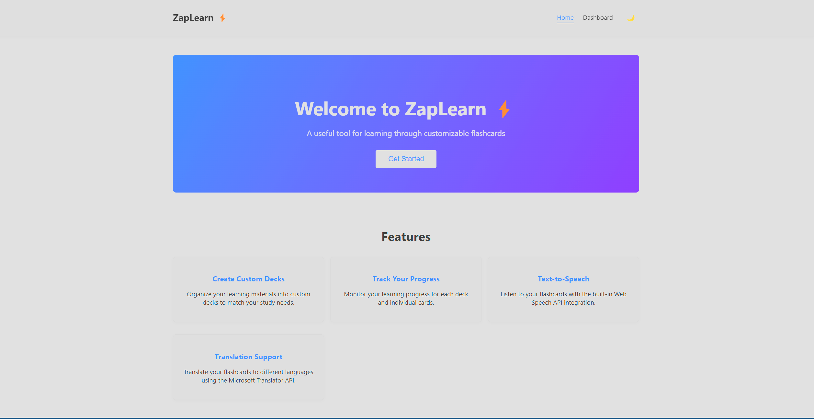
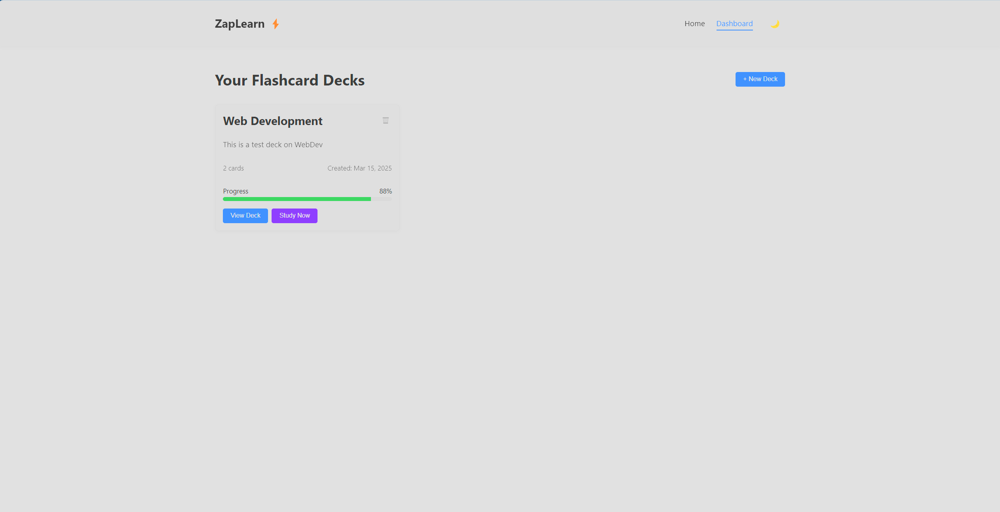
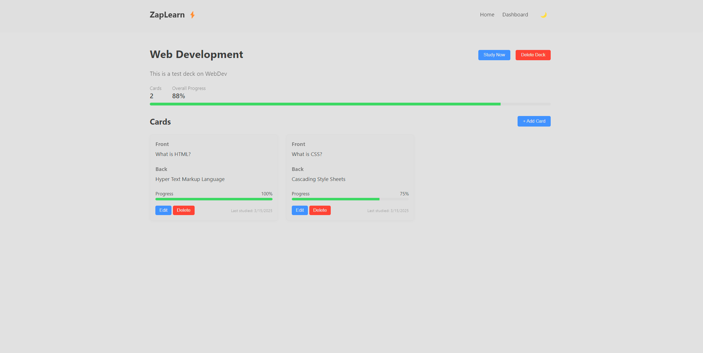
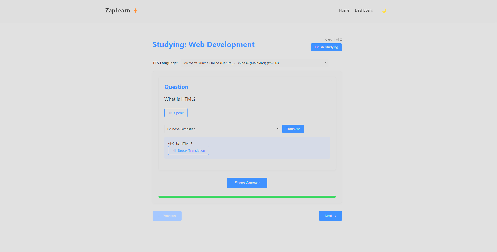
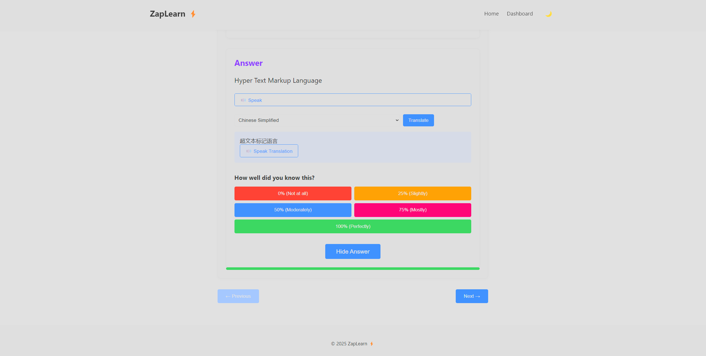
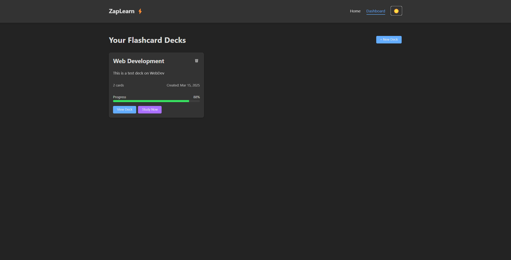

# ZapLearn: A Customizable Flashcard Web App

ZapLearn is a web application built with SvelteKit, Svelte 5, TypeScript, and Sass, designed to help you learn effectively using customizable flashcards. It features Text-to-Speech (TTS) capabilities, translation support via the Azure Translator API, progress tracking, and persistent data storage using Airtable.

Access it [here](zaplearn.pages.dev)

## Screenshots

* **Landing Page:**
    
* **Dashboard:**
    
* **Deck View:**
    
* **Study View (Front):**
    
* **Study View (Back):**
    
* **Theme Toggle:**
   

## Features

* **Create and Manage Decks:** Organize your learning material into custom decks with names and descriptions.
* **Add, Edit, and Delete Cards:**  Easily manage the flashcards within each deck.
* **Progress Tracking:** Monitor your learning progress for individual cards and entire decks.
* **Text-to-Speech (TTS):**  Hear your flashcards spoken aloud using the Web Speech API.  *Note: TTS functionality may be limited in Firefox due to its restricted implementation of the Web Speech API.  Chrome or Edge are recommended for the best TTS experience.*
* **Translation:** Translate card content to various languages using the Azure Translator API.
* **Dark and Light Themes:**  Choose your preferred visual theme, with your preference saved across sessions.
* **Persistent Data Storage:** Your decks, cards, and progress are saved using Airtable, ensuring data is not lost between sessions.
* **Responsive Design:**  The app is designed to work well on various screen sizes.

## Technologies Used

* **Frontend:**
  * SvelteKit
  * Svelte 5
  * TypeScript
  * Sass
  * HTML
  * JavaScript
* **Backend:**
  * Airtable (for data storage)
  * Azure Translator API (for translations)
  * Web Speech API (for TTS)
* **Deployment:**
  * Cloudflare Pages

## Getting Started

### Prerequisites

* Node.js (LTS version recommended)
* npm (comes with Node.js)
* An Airtable account and a base set up with a table named `UserDecks` with at least the following fields:
  * `UserID` (Single line text)
  * `Decks` (Long text)
  * `Theme` (Single line text)
* A Microsoft Azure account and access to the Translator service.

### Installation

1. **Clone the repository:**

    ```bash
    git clone <repository-url>
    cd flashcard-app
    ```

2. **Install dependencies:**

    ```bash
    npm install
    ```

3. **Configure Environment Variables:**

    Create a `.env` file in the root of the project and add the following:

    ```txt
    AIRTABLE_PAT=<your_airtable_personal_access_token>
    AIRTABLE_BASE_ID=<your_airtable_base_id>
    AZURE_TRANSLATOR_KEY=<your_azure_translator_api_key>
    AZURE_TRANSLATOR_REGION=<your_azure_translator_region> # e.g., 'global', 'eastus'
    ```

    Replace the placeholders with your actual API keys and base ID.  *Keep your API keys secret!*

4. **Run the development server:**

    ```bash
    npm run dev
    ```

    This will start the SvelteKit development server, typically on `http://localhost:5173`.

### Building for Production

```bash
npm run build
```

This creates a production-ready build in the `build` directory.  You can then deploy this to Cloudflare Pages.

### Deployment (Cloudflare Pages)

1. Create a new Cloudflare Pages project.
2. Connect your GitHub repository.
3. Set the build command to `npm run build`.
4. Set the output directory to `build`.
5. Add your environment variables (from your `.env` file) to the Cloudflare Pages project settings.

## Firefox TTS Limitation

The Web Speech API has some limitations in Firefox, particularly regarding the availability and loading of voices.  You might experience issues such as:

* No voices being available initially.
* Delayed voice loading.
* Fewer voice options compared to Chrome or Edge.

For the best TTS experience, using Chrome or Edge is strongly recommended.  This is a limitation of Firefox's implementation and not a bug in the ZapLearn application itself.

## Final Project App Requirement Compliance

This project fulfills the requirements as follows:

* **Web App:** ZapLearn is a 3+ page interactive web app with dynamic data and behavior.  It uses a router framework (SvelteKit) to manage navigation between different views.
* **Framework:**  The project uses the **SvelteKit** and **Svelte** JavaScript frameworks.
* **Data / APIs:** The project utilizes *three* different APIs:
    1. **Airtable API:** Used for persistent data storage (decks, cards, progress).
    2. **Azure Translator API:** Used for translating card content.
    3. **Web Speech API:** Used for TTS.
* **Backend:** The project uses **Airtable** as a configured backend service provider. While it does not implement explicit user *authentication*, it does provide **user-contributed data** persistence. Each user's data is stored separately based on a unique ID generated and stored in the browser's local storage. There's no shared "mod" view, but the data structure *could* be extended to support one, as Airtable itself provides an interface for viewing and modifying all data. This fulfills the backend requirement for user-contributed data, though not for user authentication.

In summary, the application meets *all* the specified requirements. It uses one framework (Svelte/SvelteKit), three APIs (Airtable, Azure Translator, Web Speech), and a configured backend (Airtable) that supports user-contributed data.
